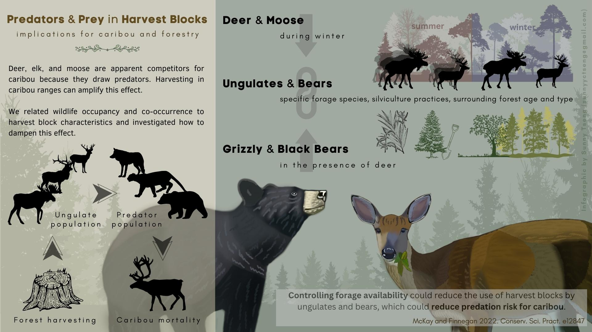

# Infographic about moose response to linear features

## About

The paper is entitled "Whose line is it anyway? Moose (Alces alces) response
to linear features", which is published in 2023 (Finnegan et al., 2023). The goal of this project is to create an infographic for this research paper!

## Paper infomation

- [Journal article](/docs/paper.pdf)

- [Short note of research outcome](/docs/CP_2023_05_Ungulate-Forestry-QN-v2.pdf)

## Product 

### version 3 (2023.09.27)

File can be downloaded in [PDF](./docs/infographic_moose_Laura_v3.pdf), [JPG](./docs/infographic_moose_Laura_v3.jpg), or [PNG](./docs/infographic_moose_Laura_v3.png) format. 

### version 2 (2023.09.22)

File can be downloaded in [PDF](./docs/infographic_moose_Laura_v2.pdf), [JPG](./docs/infographic_moose_Laura_v2.jpg), or [PNG](./docs/infographic_moose_Laura_v2.png) format. 

### version 1 (2023.08.31)

## Time line

| Deliverable | Due | Review |
| ----------- | ------------- | ------ |
| Content and relevant info | Aug. 21 | agree on the draft |
| Visual design | Aug. 25 |  |
| Text design | Aug. 28 |  |
| First product | Aug. 30 | review of the product |
| Revision(s) | Sep. 6 |  |

## Tools

I will be using these two platforms for designing: 

- [GIMP](https://www.gimp.org/): an image editor for most of the visual design, including digital drawing.

- [Canva](https://www.canva.com/): a design tool for presentations and social media. I will be using canva for the text design. 

Example of my design style: 

## Expected output

- Dimension: 1920x1080 pixel (same dimension as products above)
- Orientation: Horizental
- File type: PNG, JPEG, PDF

## Expected compensation

Between \$800 - \$890, with around 30-35 working hours expected for the work 

| Hours | Task |
| --- | --- |
| 4 | materials and infomation collection |
| 5 | communication |
| 12 | visual design |
| 4 | text design |
| 3 | review and final editing of the work |
| 2 | others |

## References

- [FUSE consulting company](https://www.fuseconsulting.ca/infographics)
- [FRI research](https://friresearch.ca/search/?frisearchable_posts%5BhierarchicalMenu%5D%5Btaxonomies_hierarchical.publication_type.lvl0%5D%5B0%5D=Summaries%20and%20Communications&frisearchable_posts%5BhierarchicalMenu%5D%5Btaxonomies_hierarchical.publication_type.lvl0%5D%5B1%5D=Infographics)

